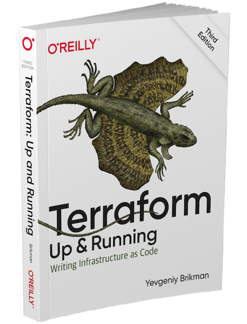

# Terraform Up and Running 3rd Edition

## Terraform: Up & Running By Yevgeniy Brikman

This book is the fastest way to get up and running with Terraform, an open source tool that allows you to define your infrastructure as code and to deploy and manage that infrastructure across a variety of public cloud providers (e.g., AWS, Azure, Google Cloud, DigitalOcean) and private cloud and virtualization platforms (e.g. OpenStack, VMWare).

This hands-on-tutorial, now in its 3rd edition, not only teaches you DevOps principles, but also walks you through code examples that you can try at home. You'll go from deploying a basic "Hello, World" Terraform example all the way up to running a full tech stack (Kubernetes cluster, load balancer, database) that can support a large amount of traffic and a large team of developers—all in the span of just a few chapters.

By the time you're done, you'll be ready to use Terraform in the real world.

